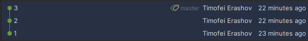
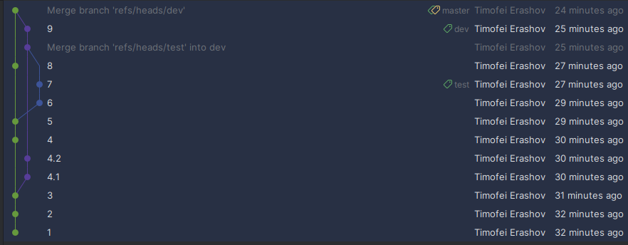
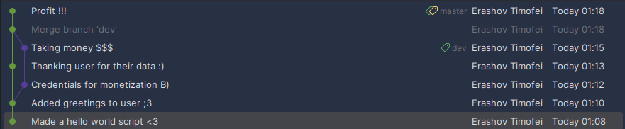

# Визуализации графа зависимостей в git-репозитории

## Введение

В данном проекте был разработан инструмент командной строки для визуализации графа зависимостей в git-репозитории. Инструмент позволяет строить граф зависимостей, включая транзитивные зависимости, и выводить его в формате Graphviz. Граф строится на основе коммитов, сделанных до заданной даты, и отображает сообщения коммитов в узлах графа.

## Цели и задачи

Основные цели проекта:
- Разработка инструмента для визуализации графа зависимостей в git-репозитории.
- Использование представления Graphviz для описания графа.
- Реализация функционала для фильтрации коммитов по дате.
- Обеспечение тестового покрытия всех функций визуализатора.

## Описание функционала

### Ключи командной строки

Инструмент принимает следующие аргументы командной строки:
- `repo_path`: Путь к анализируемому git-репозиторию.
- `output_file`: Путь к файлу, в который будет записан код графа в формате Graphviz.
- `cutoff_date`: Дата, до которой будут учитываться коммиты (в формате YYYY-MM-DD).

## Структура программы

Программа состоит из нескольких ключевых функций, каждая из которых выполняет свою задачу. Ниже приведены основные функции с объяснением их работы и соответствующими фрагментами кода.

### 1. `parse_object`

Эта функция принимает хэш объекта и возвращает словарь с информацией о коммите, дереве или блобе.

```python
def parse_object(object_hash, description=None):
    object_path = os.path.join(config['repo_path'], '.git', 'objects', object_hash[:2], object_hash[2:])
    with open(object_path, 'rb') as file:
        raw_object_content = zlib.decompress(file.read())
        header, raw_object_body = raw_object_content.split(b'\x00', maxsplit=1)
        object_type, content_size = header.decode().split(' ')
        object_dict = {}
        if object_type == 'commit':
            object_dict['label'] = 'commit/' + get_msg(raw_object_body)
            object_dict['children'] = parse_commit(raw_object_body)
            object_dict['message'] = get_msg(raw_object_body)
            object_dict['date'] = get_date(raw_object_body)
        elif object_type == 'tree':
            object_dict['label'] = r'[tree]\n' + object_hash[:6]
            object_dict['children'] = parse_tree(raw_object_body)
        elif object_type == 'blob':
            object_dict['label'] = r'[blob]\n' + object_hash[:6]
            object_dict['children'] = []
        return object_dict
```

- **Что делает**: Функция открывает объект git по его хэшу, декомпрессирует его содержимое и определяет тип объекта (коммит, дерево или блоб). В зависимости от типа, она извлекает соответствующие данные и создает словарь с информацией.
- **Зачем это нужно**: Это позволяет получить структурированную информацию о каждом объекте в репозитории, что необходимо для построения графа зависимостей.

### 2. `parse_commit_data`

Эта функция извлекает данные коммита, включая родительские коммиты и сообщение.

```python
def parse_commit_data(raw_content):
    content = raw_content.decode()
    content_lines = content.split('\n')
    commit_data = {}
    commit_data['tree'] = content_lines[0].split()[1]
    content_lines = content_lines[1:]
    commit_data['parents'] = []

    while content_lines and content_lines[0].startswith('parent'):
        commit_data['parents'].append(content_lines[0].split()[1])
        content_lines = content_lines[1:]

    while content_lines and content_lines[0].strip():
        key, *values = content_lines[0].split()
        commit_data[key] = ' '.join(values)
        content_lines = content_lines[1:]

    commit_data['message'] = '\n'.join(content_lines[1:]).strip()
    return commit_data
```

- **Что делает**: Функция декодирует содержимое коммита, разбивает его на строки и извлекает информацию о дереве, родительских коммитах и сообщении.
- **Зачем это нужно**: Это позволяет получить полную информацию о коммите, что необходимо для построения графа и отображения сообщений.

### 3. `generate_dot`

Эта функция генерирует файл в формате DOT, представляющий граф зависимостей.

```python
def generate_dot(filename, cutoff_date):
    def recursive
### 3. `generate_dot`

Эта функция генерирует файл в формате DOT, представляющий граф зависимостей.

```python
def generate_dot(filename, cutoff_date):
    def recursive_write(file, tree, written_edges):
        label = tree['label']
        for child in tree['children']:
            if child['label'].startswith('commit') and extract_unix_time(child['date']) < cutoff_date:
                edge = f'    "{label}" -> "{child["label"]}"\n'
                if edge not in written_edges:
                    file.write(edge)
                    written_edges.add(edge)
            recursive_write(file, child, written_edges)

    last_commit = get_last_commit()
    tree = parse_object(last_commit)
    with open(filename, 'w') as file:
        file.write('digraph G {\n')
        written_edges = set()
        recursive_write(file, tree, written_edges)
        file.write('}')
```

- **Что делает**: 
  - Внутренняя функция `recursive_write` рекурсивно обходит дерево зависимостей, записывая рёбра графа в файл. 
  - Она проверяет, является ли узел коммитом и находится ли его дата до заданной даты (`cutoff_date`). Если да, то создается ребро между текущим узлом и дочерним узлом.
  - Основная функция сначала получает последний коммит, затем строит дерево зависимостей и записывает его в файл в формате DOT.

- **Зачем это нужно**: Это позволяет создать визуальное представление зависимостей между коммитами, что полезно для анализа истории изменений в проекте.

### 4. `main`

Основная функция, обрабатывающая аргументы командной строки и вызывающая функцию генерации графа.

```python
def main():
    parser = argparse.ArgumentParser(description='Генерация графа зависимостей для git-репозитория.')
    parser.add_argument('repo_path', help='Путь к анализируемому репозиторию')
    parser.add_argument('output_file', help='Путь к файлу-результату в виде кода')
    parser.add_argument('cutoff_date', help='Дата коммитов в формате YYYY-MM-DD')

    args = parser.parse_args()

    global config
    config = {
        'repo_path': args.repo_path,
        'branch': 'master'
    }

    cutoff_date = datetime.strptime(args.cutoff_date, '%Y-%m-%d')

    generate_dot(args.output_file, cutoff_date)
```

- **Что делает**: 
  - Использует библиотеку `argparse` для обработки аргументов командной строки.
  - Устанавливает глобальную конфигурацию с путем к репозиторию и ветке.
  - Преобразует строку даты в объект `datetime` и вызывает функцию `generate_dot` для создания графа.

- **Зачем это нужно**: Это позволяет пользователю легко взаимодействовать с программой, передавая необходимые параметры через командную строку.

## Пример использования

Для запуска инструмента необходимо выполнить команду в терминале:

```bash
python script.py /path/to/repo /path/to/output.dot 2023-01-01
```

Где:
- `/path/to/repo` — путь к git-репозиторию, который вы хотите проанализировать.
- `/path/to/output.dot` — путь к выходному файлу, в который будет записан код графа в формате DOT.
- `2023-01-01` — дата, до которой будут учитываться коммиты. Все коммиты, сделанные после этой даты, будут исключены из графа.

После выполнения команды будет создан файл в формате DOT, который можно визуализировать с помощью Graphviz. Также будет создан PNG-файл с графом зависимостей, если установлен Graphviz.

## Тестирование

Для обеспечения надежности и корректности работы программы были созданы тесты, использующие три специально подготовленных git-репозитория. Каждый из репозиториев имеет уникальную структуру, что позволяет проверить различные сценарии работы инструмента. Ниже описаны репозитории и соответствующие тесты.

### Структуры репозиториев

1. **Репозиторий 1**: 
   - Структура: три коммита, идущие друг за другом.
   - Ожидаемый результат: граф должен отображать три последовательных коммита без разветвлений.
   - Файл результата: `graph1.png`.

   

2. **Репозиторий 2**: 
   - Структура: множество веток, которые сливаются.
   - Ожидаемый результат: граф должен корректно отображать все ветки и точки слияния.
   - Файл результата: `graph2.png`.

   

3. **Репозиторий 3**: 
   - Структура: последовательные коммиты, сливающиеся ветки и корректно отображающиеся комментарии к коммитам.
   - Ожидаемый результат: граф должен отображать как последовательные коммиты, так и слияния, с правильными сообщениями коммитов.
   - Файл результата: `graph3.png`.

   

### Тестовые сценарии

Для каждого репозитория были разработаны тестовые сценарии, которые проверяют следующие аспекты:

1. **Корректность извлечения данных**:
   - Проверка, что все коммиты извлекаются правильно, включая сообщения и даты.
   - Убедиться, что родительские коммиты правильно определяются для каждого коммита.

2. **Построение графа**:
   - Проверка, что граф формируется корректно для каждого репозитория.
   - Сравнение с ожидаемыми результатами (файлы `graph1.png`, `graph2.png`, `graph3.png`).

3. **Обработка различных сценариев**:
   - Для репозитория 1: проверить, что граф отображает три последовательных коммита.
   - Для репозитория 2: убедиться, что все ветки и точки слияния отображаются правильно.
   - Для репозитория 3: проверить, что граф отображает как последовательные коммиты, так и слияния, с правильными сообщениями.

### Пример теста

Тесты могут быть реализованы с использованием библиотеки `unittest` или `pytest`. Пример теста для репозитория 1 может выглядеть следующим образом:

```python
import unittest
import subprocess
import os

class TestGraphGeneration(unittest.TestCase):
    def setUp(self):
        self.repo_path = '/path/to/repo1'
        self.output_file = '/path/to/output1.dot'
        self.cutoff_date = '2023-01-01'

    def test_graph_generation_repo1(self):
        # Запуск инструмента для генерации графа
        subprocess.run(['python', 'script.py', self.repo_path, self.output_file, self.cutoff_date], check=True)

        # Сравнение с ожидаемым результатом
        expected_graph = 'path/to/expected/graph1.png'
        generated_graph = 'path/to/generated/graph1.png'
        self.assertTrue(compare_images(expected_graph, generated_graph))

def compare_images(expected, generated):
    # Функция для сравнения изображений (можно использовать библиотеку PIL)
    pass

if __name__ == '__main__':
    unittest.main()
```

## Заключение

Разработанный инструмент позволяет эффективно визуализировать граф зависимостей в git-репозиториях, что может быть полезно для анализа истории изменений и понимания структуры проекта. Инструмент легко настраивается и расширяется, что позволяет адаптировать его под различные задачи. Все функции визуализатора были покрыты тестами, что обеспечивает надежность и корректность работы программы.
